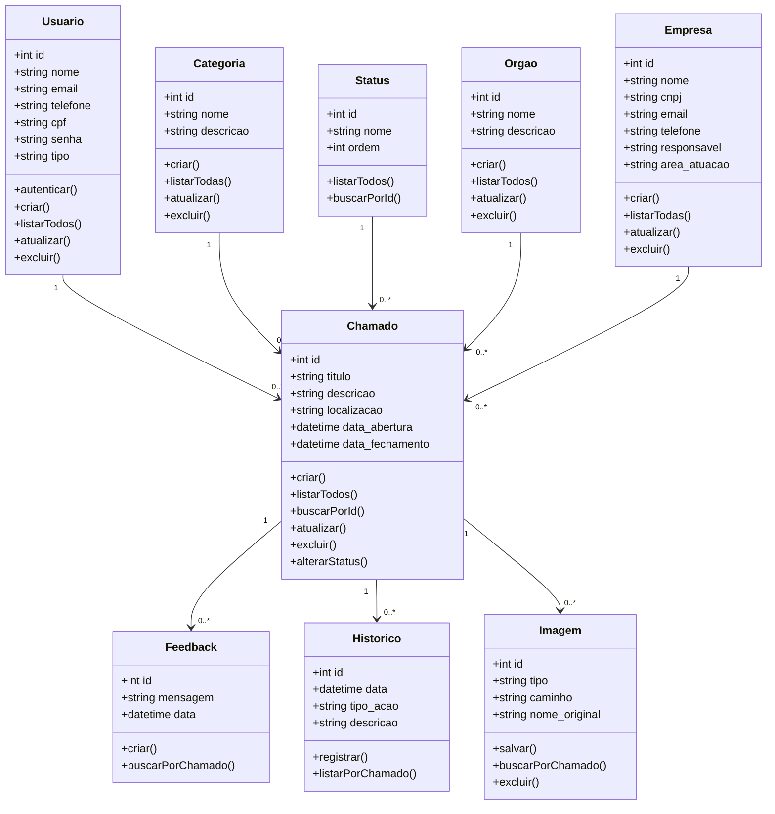
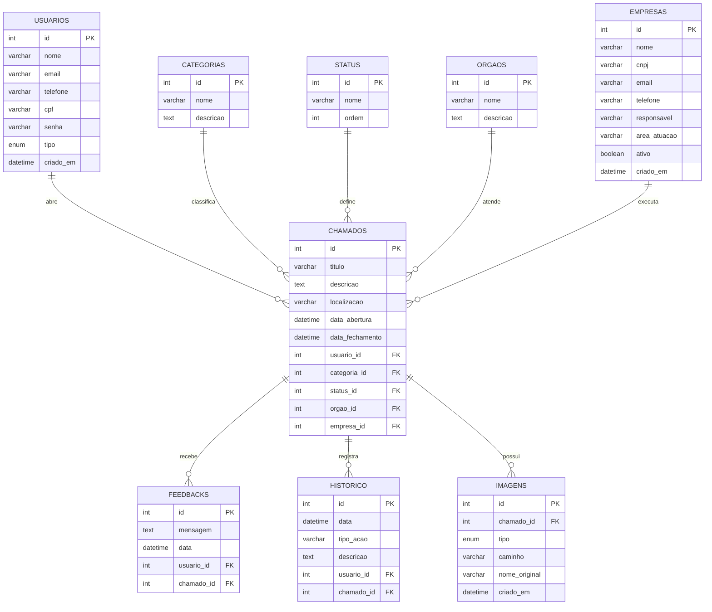

# Portal do Cidadão - Prefeitura Municipal

Sistema web desenvolvido em PHP para cadastro, acompanhamento e gerenciamento de chamados públicos municipais. O projeto simula um portal de atendimento da prefeitura, permitindo que cidadãos registrem solicitações e que administradores acompanhem, filtrem, atualizem e finalizem os chamados.

## Aluno

- Arthur Mesquita Vieira

## Tema

Portal de serviços públicos municipais, com foco no atendimento ao cidadão e no gerenciamento administrativo de solicitações urbanas.

## Descrição do sistema

O Portal do Cidadão permite que usuários se cadastrem, façam login e abram chamados relacionados a problemas ou solicitações da cidade, como iluminação pública, pavimentação, coleta de lixo, saneamento, saúde, educação e trânsito.

Na área administrativa, usuários com perfil de administrador podem visualizar indicadores, gerenciar chamados, alterar status, atribuir órgãos responsáveis, vincular empresas parceiras, enviar feedbacks ao cidadão e manter os cadastros principais do sistema.

## Tecnologias utilizadas

- PHP 8
- MySQL/MariaDB
- HTML5
- CSS3
- JavaScript
- Alpine.js
- Apache/XAMPP

## Regras de negócio

- O cidadão precisa estar cadastrado e autenticado para abrir um chamado.
- Cada chamado deve possuir título, descrição, categoria e usuário responsável pela abertura.
- Todo chamado inicia com o status `Aberto`.
- Administradores podem alterar status, categoria, órgão responsável e empresa parceira de um chamado.
- Quando um feedback final é enviado, o chamado pode ser marcado como resolvido.
- Apenas administradores podem acessar a área administrativa.
- Um usuário comum não pode visualizar chamados de outros cidadãos.
- O sistema registra histórico das principais ações realizadas nos chamados.
- Imagens enviadas devem respeitar os tipos e o limite de tamanho definidos no sistema.

## Funcionalidades implementadas

- Página inicial pública com apresentação do portal.
- Exibição de chamados resolvidos na página pública.
- Cadastro de cidadãos.
- Login de cidadão.
- Login de administrador.
- Logout.
- Dashboard administrativo com indicadores.
- Listagem e filtros de chamados.
- Página de detalhes do chamado.
- Abertura de chamados pelo cidadão.
- Upload de imagem no chamado.
- Envio de feedback pelo administrador.
- Histórico de ações do chamado.
- Atribuição de órgão responsável.
- Atribuição de empresa parceira.
- Validação de formulários no frontend e backend.

## CRUDs implementados

| Classe      | Entidade                | Operações                                   |
| ----------- | ----------------------- | ------------------------------------------- |
| `Usuario`   | Usuários e cidadãos     | Criar, listar, editar e excluir             |
| `Chamado`   | Chamados públicos       | Criar, listar, visualizar, editar e excluir |
| `Categoria` | Categorias dos chamados | Criar, listar, editar e excluir             |
| `Orgao`     | Órgãos responsáveis     | Criar, listar, editar e excluir             |
| `Empresa`   | Empresas parceiras      | Criar, listar, editar e excluir             |

Outras classes de apoio:

- `Status`
- `Feedback`
- `Historico`
- `Imagem`

## Diagrama de classes



## Modelo do banco de dados



## Estrutura do projeto

```text
prefeitura/
|-- app/
|   |-- controllers/
|   |   |-- AdminController.php
|   |   |-- AuthController.php
|   |   |-- CidadaoController.php
|   |   `-- PortalController.php
|   |-- models/
|   |   |-- Categoria.php
|   |   |-- Chamado.php
|   |   |-- Empresa.php
|   |   |-- Feedback.php
|   |   |-- Historico.php
|   |   |-- Imagem.php
|   |   |-- Orgao.php
|   |   |-- Status.php
|   |   `-- Usuario.php
|   `-- views/
|       |-- admin/
|       |-- cidadao/
|       |-- portal/
|       `-- shared/
|-- config/
|   |-- app.php
|   `-- database.php
|-- database/
|   `-- prefeitura_db.sql
|-- public/
|   |-- css/
|   |-- imgs/
|   |-- js/
|   `-- index.php
`-- README.md
```

## Instalação e execução

### 1. Clonar o repositório

```bash
git clone https://github.com/ArthurM-V/prefeitura.git
```

Coloque a pasta do projeto dentro do diretório `htdocs` do XAMPP:

```text
C:/xampp/htdocs/prefeitura
```

### 2. Criar/importar o banco de dados

Importe o arquivo SQL:

```text
database/prefeitura_db.sql
```

Pelo terminal:

```bash
mysql -u root -p < database/prefeitura_db.sql
```

Ou pelo phpMyAdmin, criando/importando o banco `prefeitura_db`.

### 3. Configurar conexão

Confira as credenciais em `config/database.php`:

```php
define('DB_HOST', 'localhost');
define('DB_NAME', 'prefeitura_db');
define('DB_USER', 'root');
define('DB_PASS', '');
define('DB_CHARSET', 'utf8mb4');
```

### 4. Configurar URL base

Confira a constante em `config/app.php`:

```php
define('BASE_URL', '/prefeitura');
```

### 5. Iniciar o Apache e MySQL

No XAMPP, inicie:

- Apache
- MySQL

Depois acesse:

```text
http://localhost/prefeitura/
```

## Rotas principais

### Públicas

| Rota        | Descrição              |
| ----------- | ---------------------- |
| `/`         | Página inicial pública |
| `/entrar`   | Login do cidadão       |
| `/cadastro` | Cadastro de cidadão    |
| `/login`    | Login do administrador |
| `/logout`   | Encerrar sessão        |

### Área do cidadão

| Rota                     | Descrição                    |
| ------------------------ | ---------------------------- |
| `/cidadao/dashboard`     | Lista de chamados do cidadão |
| `/cidadao/abrir-chamado` | Envio de novo chamado        |
| `/cidadao/chamado/{id}`  | Detalhes do chamado          |

### Área administrativa

| Rota                  | Descrição                      |
| --------------------- | ------------------------------ |
| `/admin/dashboard`    | Dashboard administrativo       |
| `/admin/chamados`     | Listagem e filtros de chamados |
| `/admin/chamado/{id}` | Detalhes e ações do chamado    |
| `/admin/usuarios`     | CRUD de usuários               |
| `/admin/categorias`   | CRUD de categorias             |
| `/admin/orgaos`       | CRUD de órgãos                 |
| `/admin/empresas`     | CRUD de empresas parceiras     |

## Usuário e senha de teste

### Administrador

| Campo  | Valor                     |
| ------ | ------------------------- |
| E-mail | `admin@prefeitura.gov.br` |
| Senha  | `password`                |

### Cidadão de teste

| Campo  | Valor            |
| ------ | ---------------- |
| E-mail | `joao@email.com` |
| CPF    | `123.456.789-00` |
| Senha  | `password`       |
